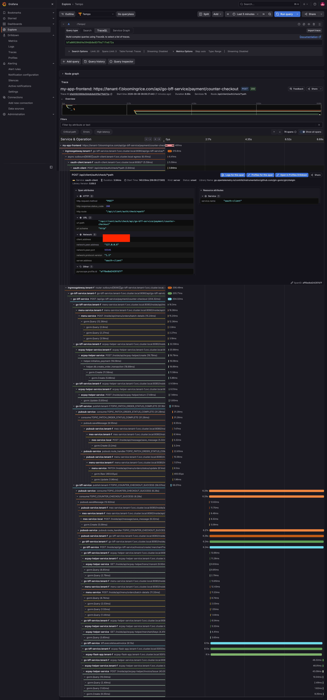
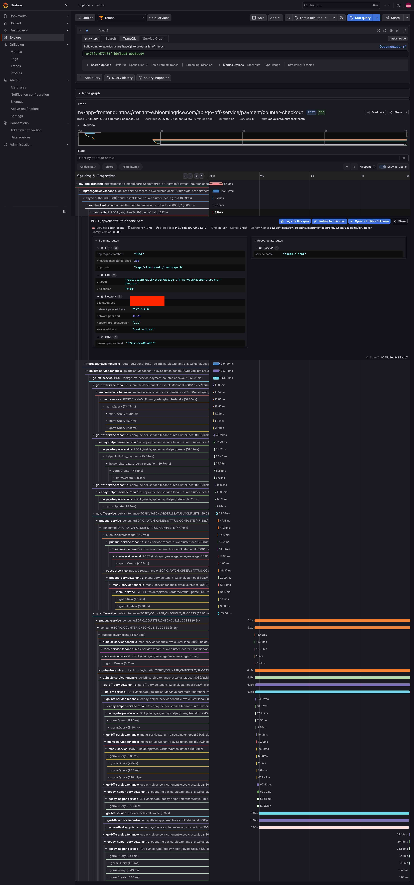
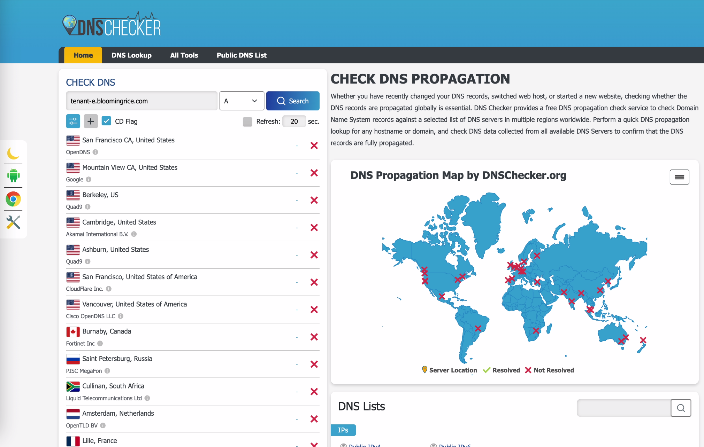
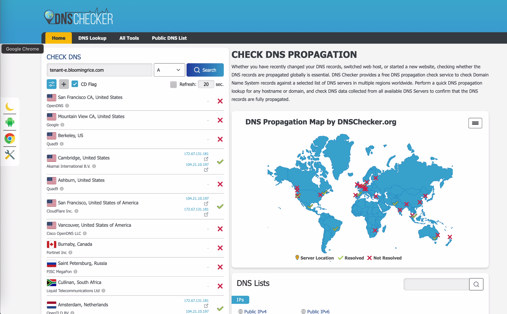
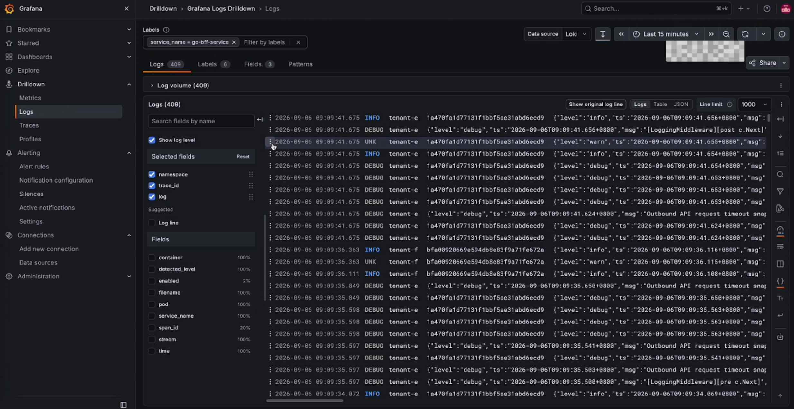

# Multi-tenancy

本篇展示使用 k8s operator 部署 Multi-tenancy

[影片demo](https://youtu.be/BpllOKYXWM4)

```sh

k get bloomingtenant
No resources found

cat gitops_v1alpha1_tenant-e-k8s.yaml | grep kind
kind: BloomingTenant

k apply -k .
bloomingtenant.gitops.example.com/tenant-e created
bloomingtenant.gitops.example.com/tenant-f created

sudo dscacheutil -flushcache; sudo killall -HUP mDNSResponder

k get bloomingtenant
NAME       PHASE   READY   AGE
tenant-e   Ready   True    2m33s
tenant-f   Ready   True    2m33s
```

## Trace 

Start Time
 - tenant-f 2026-09-06 09:09:27
 - tenant-e 2026-09-06 09:09:33




## 部署前 DNS 未註冊



## 部署後 DNS 已註冊



## 可以看到兩個 tenant 的 log


