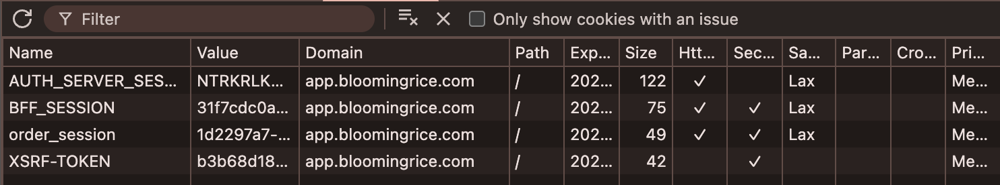

# OAuth2 Login

目前系統同時支援兩種登入模式：

1. Web (BFF + Session)
    - [Web](https://app.bloomingrice.com)
2. Native App (OAuth2 PKCE + Deep Link)
    - Token 機制（Access + Refresh Token）
    - [Android](https://play.google.com/store/apps/details?id=com.bloomingrice.app&hl=zh_TW)


## Deep Link
```xml
<intent-filter>
    <action android:name="android.intent.action.VIEW" />
    <category android:name="android.intent.category.DEFAULT" />
    <category android:name="android.intent.category.BROWSABLE" />
    <data android:scheme="xxx-app" android:host="oauth2" android:path="/callback" />
</intent-filter>
```

## HttpOnly Cookie（Session ID）


