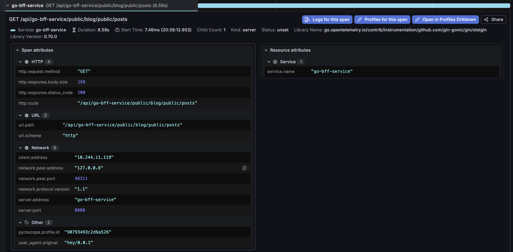
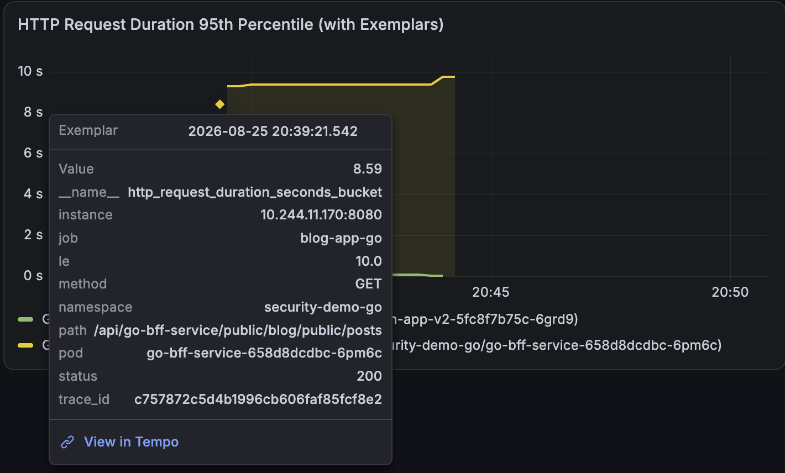

# DevOpsDemo

- 後端功能 
    1. OAuth2 login
    2. Firebase Cloud Messaging
    3. GCP Pub/Sub
    4. ecpay invoice
    5. [影片demo](https://youtu.be/37fLkmcH-qk)

- Trace 展示
    1. 前端觸發 my-app-frontend 
    2. istio-ingressgateway
    3. 後端邏輯
    4. GCP Pub/Sub
    5. 呼叫 ecpay invoice

## Trace to Log & Trace to profiles

## Exemplar to Trace

## k8s operator Multi-tenancy 展示

本篇展示使用 k8s operator 部署 Multi-tenancy

[Multi-tenancy](Multi-tenancy/README.md)

## On-Premises-k8s 展示

展示基於 On-Premises（地端） 的 RKE2 Kubernetes 高可用（HA）集群 與 負載均衡架構設計與驗證紀錄。

[On-Premises-k8s](On-Premises-k8s/README.md)

# OAuth2 Login

介紹目前系統同時支援兩種登入模式：

[OAuth2](OAuth2/README.md)

## ecpay 付款功能

ecpay 付款功能已完整部署至 GCP 雲端平台，並透過 Cloudflare 進行 DNS 解析與網路管理。

[checkout](https://app.bloomingrice.com/menu_order/c5b52e3b-3dee-488d-bebd-f9e216547d68)

## Security

以下連結說明資訊安全與系統強化上的實踐成果。透過多項業界標準的資安測試與掃描工具，全面檢驗並證明系統在網路傳輸、應用程式邏輯、容器架構與弱點防禦上具備高標準的安全性：

[Security](./Security.md)
