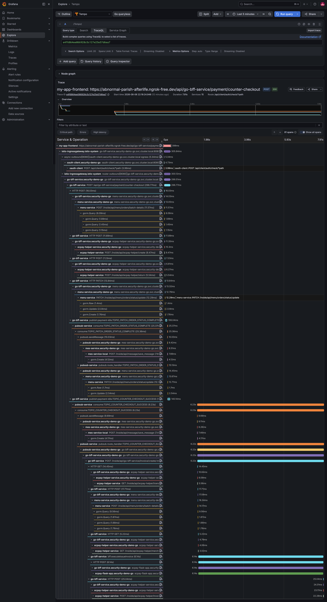
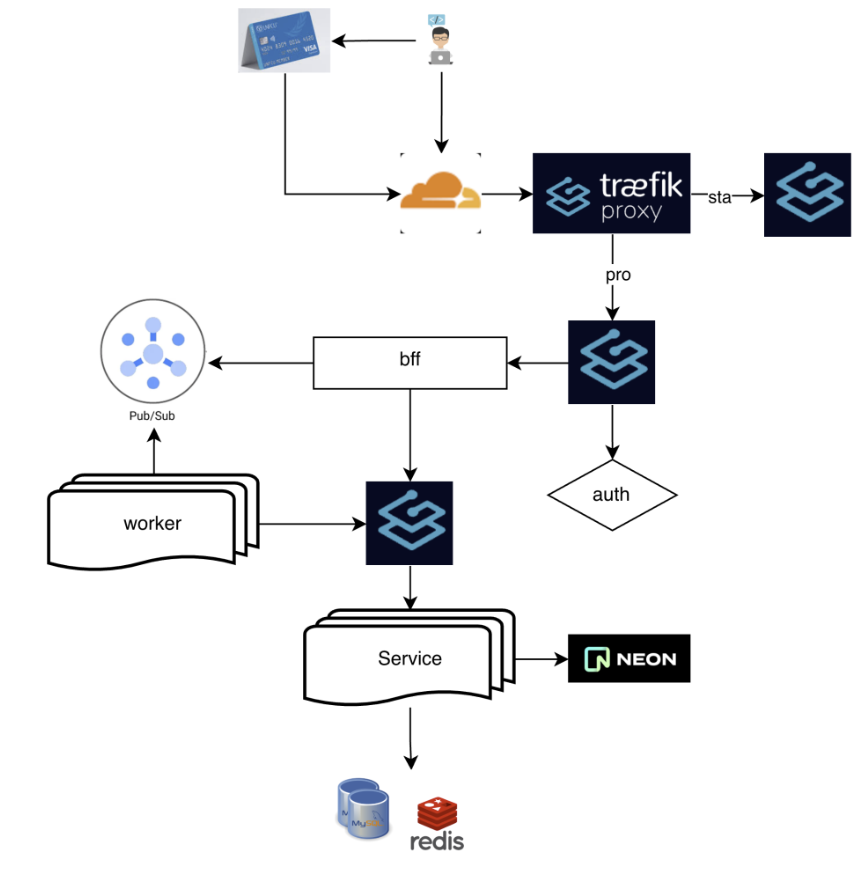

# DevOpsDemo

- 後端功能 
    1. OAuth2 login
    2. Firebase Cloud Messaging
    3. GCP Pub/Sub
    4. ecpay invoce
    5. [影片demo](https://youtu.be/37fLkmcH-qk)

- Trace 展示
    1. 前端觸發 my-app-frontend 
    2. istio-ingressgateway
    3. 後端邏輯
    4. GCP Pub/Sub
    5. 呼叫 ecpay invoce

## ecpay 付款功能

ecpay 付款功能已完整部署至 GCP 雲端平台，並透過 Cloudflare 進行 DNS 解析與網路管理。

[checkout](https://app.bloomingrice.com/menu_order/c5b52e3b-3dee-488d-bebd-f9e216547d68)

## Security

[Security](./Security.md)
