## Security Testing & Hardening

本篇說明本專案在資訊安全與系統強化上的實踐成果。透過多項業界標準的資安測試與掃描工具，全面檢驗並證明系統在網路傳輸、應用程式邏輯、容器架構與弱點防禦上具備高標準的安全性：

SSL/TLS 與傳輸安全：透過 SSL Labs 進行深度評測，確認網站憑證與加密設定達到 A+ 最高等級，並完整實作 HSTS (HTTP Strict Transport Security) 與現代安全回應標頭，確保資料傳輸的最高機密性與完整性。

應用程式安全與弱點掃描：使用 OWASP ZAP 進行動態應用程式安全測試 (DAST)，確保生產環境在 High 與 Medium 風險級別上維持 0 漏洞 的安全狀態。

資安滲透測試：運用 Burp Suite 針對關鍵 API 執行安全性檢測，有效防範 IDOR (Insecure Direct Object Reference) 等權限越權與物件參照漏洞。

基礎設施與網路弱點掃描：透過 OpenVAS (Greenbone) 執行深度的網路與主機層級弱點掃描，全面排查潛在系統風險。

容器與供應鏈安全：使用 Trivy ，對後端微服務 Docker 映像檔與相依套件進行嚴格的漏洞與機密（Secret）掃描，維持乾淨且安全的部署環境。

### 🔍 Penetration Testing
**Burp Suite - IDOR (Insecure Direct Object Reference) Testing**
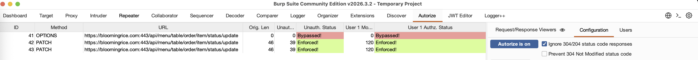
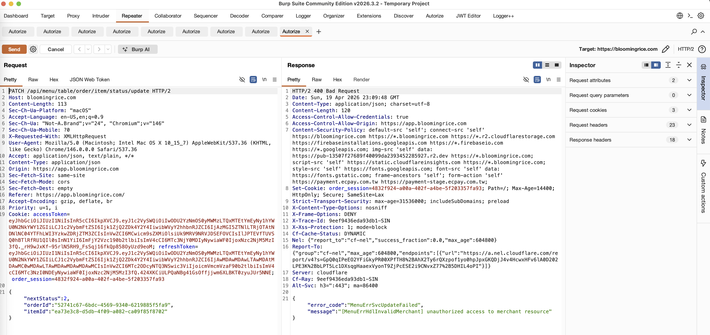

### 🛡️ Web Security Headers
**HSTS (HTTP Strict Transport Security) Implementation**
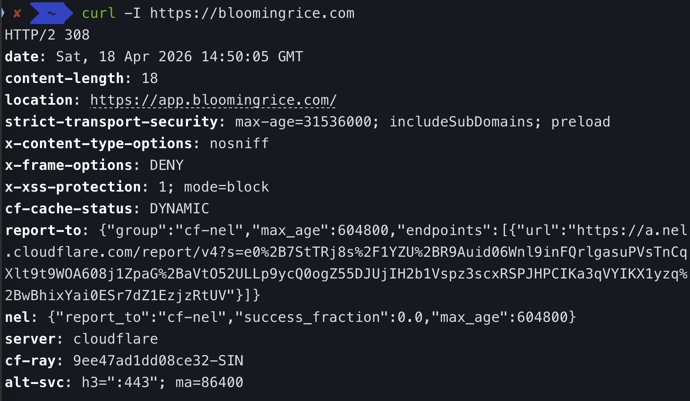

### 🔒 SSL/TLS Security
**SSL Labs Security Assessment**
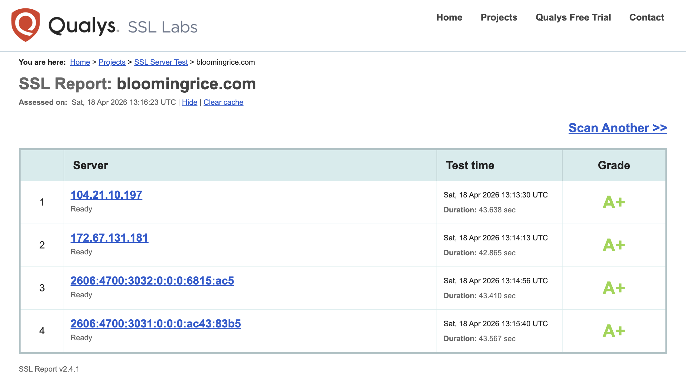

### 🚨 Automated Security Scanning
**OWASP ZAP Security Analysis**
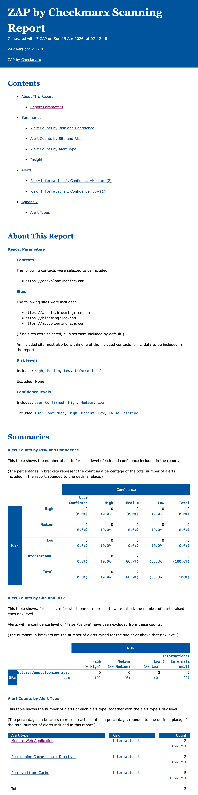

### 🔍 Network Vulnerability Scanning
**OpenVAS (Greenbone Vulnerability Management)**
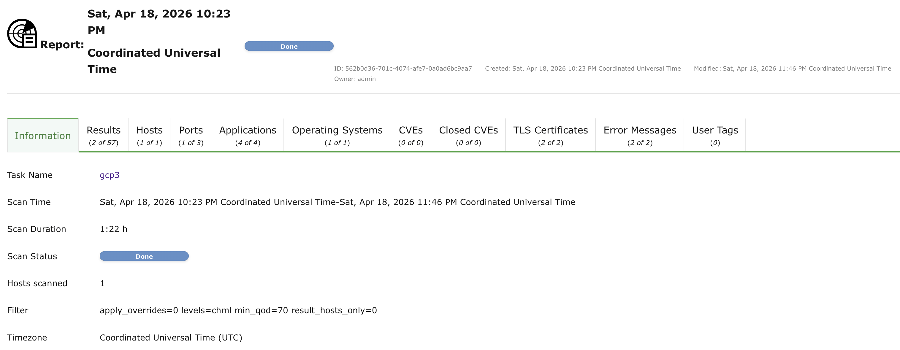
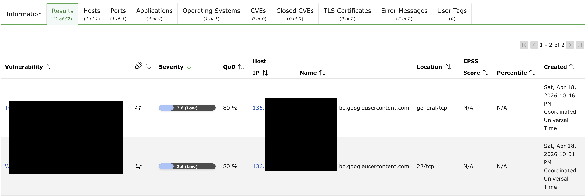
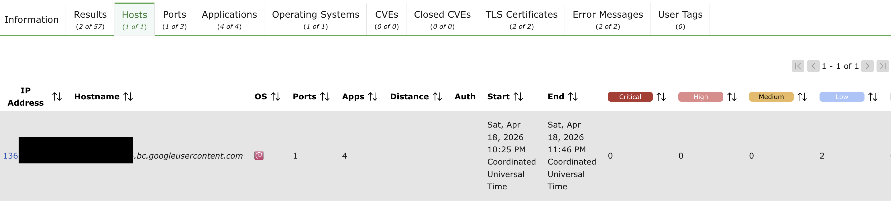
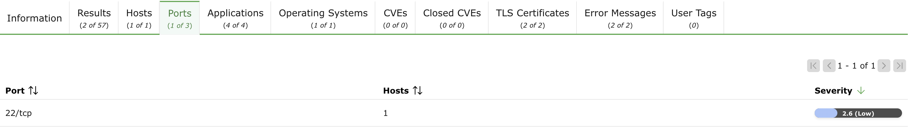
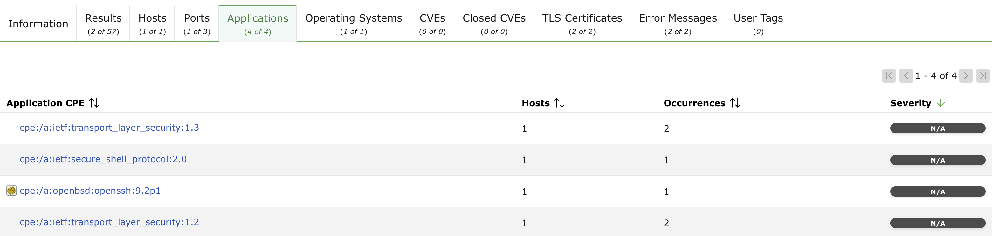
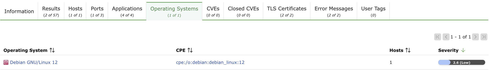
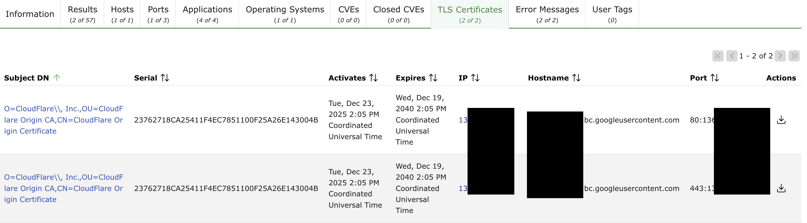
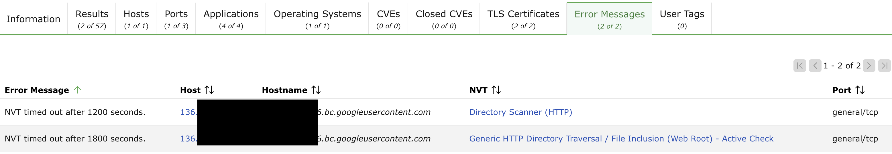
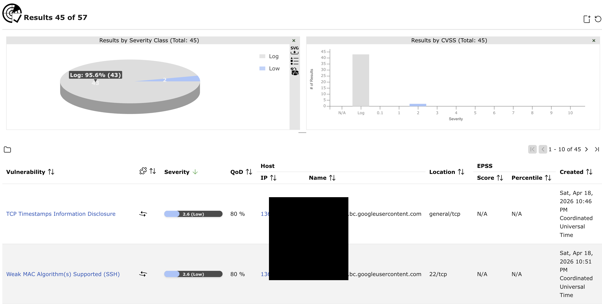
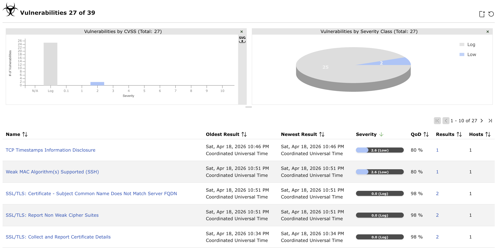

### 🐳 Container & Infrastructure Security
**Trivy Vulnerability Scanner**
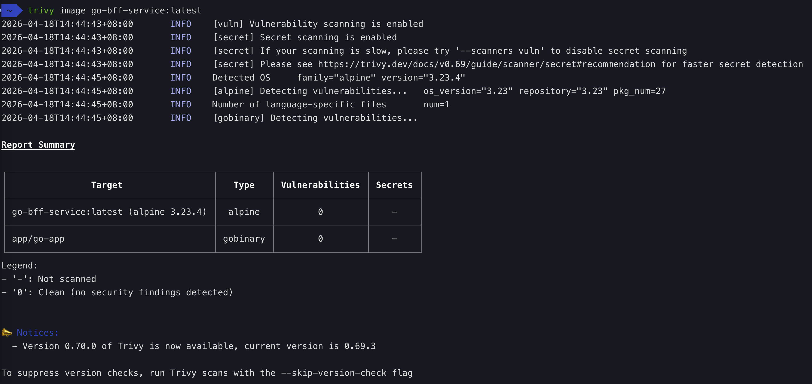
